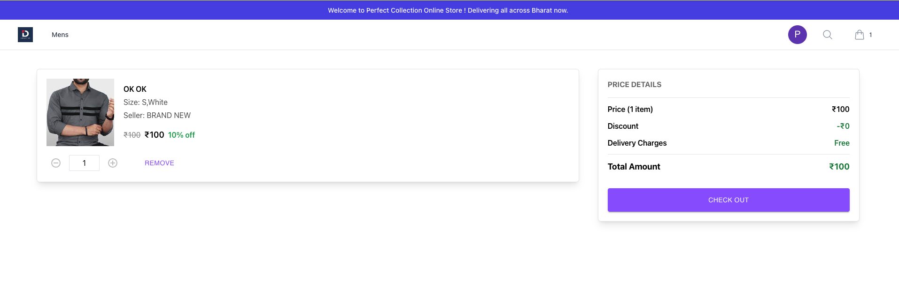

### Blog Item
- https://paraskaushik.hashnode.dev/low-level-design-for-amazon-shopping
### Requirements

* **User Authentication:**

    * Implement a secure user registration system.

    * Develop a user login mechanism with proper authentication.

* **User Profiles:**

    * Allow users to create and update their profiles.

* **Product Management:**

    * Enable the creation, deletion, and updating of product information.

    * Support product retrieval by ID or category.

    * Implement a search feature to find products based on user queries.

    * Maintain a comprehensive list of all available products.

* **Shopping Cart:**

    * Provide users with the ability to create and manage their shopping carts.

    * Allow users to add, update, and remove items from their carts.

* **Order Processing:**

    * Develop a system for users to place orders.

    * Enable users to view their order history.

    * Implement order status management, including order confirmation, shipping, delivery, and cancellation.

* **Payment Handling:**

    * Create payment links for order transactions.

    * Allow users to update their payment information securely.

* **Product Reviews and Ratings:**

    * Implement a feature for users to create product reviews.

    * Enable users to rate products.

    * Display product ratings to users.

* **Order Tracking:**

    * Provide users with the ability to view all their orders.

### Models Identification

We can see models of the system will include :

1. Cart

2. CartItem

3. Product

4. User

5. Address

6. Reviews

7. Ratings

8. Category

9. Order

10. Order Item

    

### Service Identification

### Demo
#### Home Page

#### Products Page

#### Login/Sign-in modal

#### Cart

#### Checkout

#### Admin Dashboard

#### Admin Orders

### APIs

| **Service API** | **Description** |
| --- | --- |
| **createUser(userData)** | Creates a new user with the provided data, including first name, last name, email, password, and role. If a user with the same email already exists, it throws an error. |
| **findUserById(userId)** | Finds a user by their ID and returns their information. If the user is not found, it throws an error. |
| **getUserByEmail(email)** | Retrieves a user by their email. If the user is not found, it throws an error. |
| **getUserProfileByToken(token)** | Retrieves a user's profile using a token, and ensures the user's password is not included in the response. If the user doesn't exist, it throws an error. |
| **getAllUsers()** | Fetches all users in the system and returns them. If there's an error, it throws an error. |
| **createCart(user)** | Creates a new cart for a user and returns the created cart. |
| **findUserCart(userId)** | Finds a user's cart, updates cart details including cart items, and returns the cart. |
| **addCartItem(userId, req)** | Adds an item to the user's cart based on the provided product information. Returns a confirmation message. |
| **createCartItem(cartItemData)** | Creates a new cart item with the provided data, including quantity, price, and discounted price, and returns the created cart item. |
| **updateCartItem(userId, cartItemId, cartItemData)** | Updates an existing cart item with the provided data, such as quantity, price, and discounted price. It ensures that the user can only update their own cart item. |
| **isCartItemExist(cart, product, size, userId)** | Checks if a cart item already exists in the user's cart based on the provided parameters and returns the cart item if found. |
| **removeCartItem(userId, cartItemId)** | Removes a cart item from the user's cart. It checks that the user can only remove their own cart item. |
| **findCartItemById(cartItemId)** | Finds a cart item by its ID and returns its details. If the cart item doesn't exist, it throws a CartItemException. |
| **createProduct(reqData)** | Creates a new product with the provided data and returns the saved product. |
| **deleteProduct(productId)** | Deletes a product by its ID. If the product doesn't exist, it throws an error. |
| **updateProduct(productId, reqData)** | Updates a product's information by its ID and returns the updated product. |
| **findProductById(id)** | Finds a product by its ID and returns its details. If the product doesn't exist, it throws an error. |
| **getAllProducts(reqQuery)** | Retrieves a list of products with filtering and pagination options. Returns the product list along with pagination information. |
| **createMultipleProduct(products)** | Creates multiple products based on the provided data. |
| **createOrder(user, shippAddress)** | Creates a new order with user and shipping address information, along with order items. |
| **placedOrder(orderId)** | Updates the order status to "PLACED" and payment status to "COMPLETED" for the given order. |
| **confirmedOrder(orderId)** | Updates the order status to "CONFIRMED" for the given order. |
| **shipOrder(orderId)** | Updates the order status to "SHIPPED" for the given order. |
| **deliveredOrder(orderId)** | Updates the order status to "DELIVERED" for the given order. |
| **cancelledOrder(orderId)** | Updates the order status to "CANCELLED" for the given order. |
| **findOrderById(orderId)** | Finds an order by its ID and returns its details. |
| **usersOrderHistory(userId)** | Retrieves the order history of a user with the "PLACED" status. |
| **getAllOrders()** | Retrieves all orders with details. |
| **deleteOrder(orderId)** | Deletes an order by its ID, and if the order doesn't exist, it throws an error. |
| **createPaymentLink(orderId)** | Creates a payment link for an order, including details such as amount, currency, customer information, and callback URL. Returns the payment link URL and ID. |
| **updatePaymentInformation(reqData)** | Updates the payment information and order status for a completed payment. Returns a message indicating the order is placed. |
| **createReview(reqData, user)** | Creates a new review for a product with the provided data, associated with a user and a product. |
| **getAllReview(productId)** | Retrieves all reviews for a product based on the product's ID. Returns the list of reviews, each associated with a user. |
| **createRating(req, user)** | Creates a new rating for a product with the provided data, associated with a user and a product. |
| **getProductsRating(productId)** | Retrieves all ratings for a product based on the product's ID. Returns the list of ratings for the product. |

### Processing Requests

| **Request** | **Input** | **Processing** | **Output** |
| --- | --- | --- | --- |
| **User Registration** | User details (name, email, password) | Validate input, create a user, generate a JWT, create a shopping cart | Successful registration - status 200, JWT, and success message. Errors - status 500 and an error message. |
| **User Login** | User login details (email, password) | Validate input, check user existence, verify password, generate a JWT | Successful login - status 200, JWT, and success message. User not found - status 404 and "User not found" message. Invalid password - status 401 and "Invalid password" message. Errors - status 500 and an error message. |
| **Get User Profile** | JWT token in the request header | Check for JWT, retrieve user profile using the JWT | Successful profile retrieval - status 200 and user profile data. Token not found - status 404 and "token not found" error message. Errors - status 500 and an error message. |
| **Get All Users** | None | Retrieve all user profiles using the userService | Successful retrieval - status 200 and a list of user profiles. Errors - status 500 and an error message. |
| **Create a Product** | Product data in the request body | Create a new product using productService, respond with status 201 and the created product. | In case of an error, respond with status 500 and an error message. |
| **Delete a Product by ID** | Product ID in the request parameters | Delete a product using productService, respond with a success message. | In case of an error, respond with status 500 and an error message. |
| **Update a Product by ID** | Product ID in the request parameters, product data in the request body | Update a product using productService, respond with the updated product. | In case of an error, respond with status 500 and an error message. |
| **Find a Product by ID** | Product ID in the request parameters | Find a product by ID using productService, respond with the product data. | If the product is not found, respond with status 404 and an error message. In case of other errors, respond with status 500 and an error message. |
| **Find Products by Category** | Category in the request parameters | Find products by category using productService, respond with the list of products. | In case of an error, respond with status 500 and an error message. |
| **Search Products by Query** | Query in the request parameters | Search products by query using productService, respond with the list of products matching the query. | In case of an error, respond with status 500 and an error message. |
| **Get All Products** | Query parameters for filtering and pagination | Retrieve products with filtering and pagination, respond with the list of products. | In case of an error, respond with status 500 and an error message. |
| **Create Multiple Products** | Multiple product data in the request body | Create multiple products using productService, respond with a success message. | In case of an error, respond with status 500 and an error message. |
| **Find User Cart** | User data from the request (req.user) | Find the user's cart using cartService, respond with status 200 and the user's cart data. | In case of an error, respond with status 500 and an error message. |
| **Add Item to Cart** | User data from the request (req.user), item data in the request body | Add an item to the user's cart using cartService, respond with status 202 and a success message. | In case of an error, respond with status 500 and an error message. |
| **Update Cart Item** | User data from the request (req.user), cart item ID in the request parameters, updated item data in the request body | Update a cart item using cartItemService, respond with status 200 and the updated cart item data. | In case of an error, respond with status 500 and an error message. |
| **Remove Cart Item** | User data from the request (req.user), cart item ID in the request parameters | Remove a cart item using cartItemService, respond with status 200 and a success message. | In case of an error, respond with status 500 and an error message. |
| **Create Order** | User data from the request (req.user), order data in the request body | Create an order using orderService, respond with status 201 and the created order. | In case of an error, respond with status 500 and an error message. |
| **Find Order by ID** | User data from the request (req.user), order ID in the request parameters | Find an order by ID using orderService, respond with status 200 and the order data. | In case of an error, respond with status 500 and an error message. |
| **Order History** | User data from the request (req.user) | Retrieve a user's order history using orderService, respond with status 200 and the order history. | In case of an error, respond with status 500 and an error message. |
| **Create Payment Link** | Order ID in the request parameters | Create a payment link using paymentService, respond with status 200 and the payment link. | In case of an error, respond with status 500 and an error message. |
| **Update Payment Information** | Query parameters with payment information | Update payment information using paymentService, respond with status 200 and a success message. | In case of an error, respond with status 500 and an error message. |
| **Create Review** | User data from the request (req.user), review data in the request body | Create a review using reviewService, respond with status 201 and the created review. | In case of an error, respond with status 500 and an error message. |
| **Get All Reviews** | Product ID in the request parameters | Retrieve all reviews for a specific product using reviewService, respond with status 200 and the list of reviews. | In case of an error, respond with status 500 and an error message. |
| **Create Rating** | User data from the request (req.user), rating data in the request body | Create a rating using ratingService, respond with status 202 and the created rating. | In case of an error, respond with status 500 and an error message. |
| **Get Products Rating** | Product ID in the request parameters | Retrieve ratings for a specific product using ratingService, respond with status 200 and the list of ratings. | In case of an error, respond with status 500 and an error message. |
| **Get All Orders** | None | Retrieve all orders using orderService, respond with status 202 and the list of orders. | In case of an error, respond with status 500 and an error message. |
| **Confirm Order** | Order ID in the request parameters | Confirm an order using orderService, respond with status 202 and the confirmed order. | In case of an error, respond with status 500 and an error message. |
| **Ship Order** | Order ID in the request parameters | Ship an order using orderService, respond with status 202 and the shipped order. | In case of an error, respond with status 500 and an error message. |
| **Deliver Order** | Order ID in the request parameters | Mark an order as delivered using orderService, respond with status 202 and the delivered order. | In case of an error, respond with status 500 and an error message. |
| **Cancel Order** | Order ID in the request parameters | Cancel an order using orderService, respond with status 202 and the cancelled order. | In case of an error, respond with status 500 and an error message. |
| **Delete Order** | Order ID in the request parameters | Delete an order using orderService, respond with status 202 and a success message. | In case of an error, respond with status 500 and an error message. |
